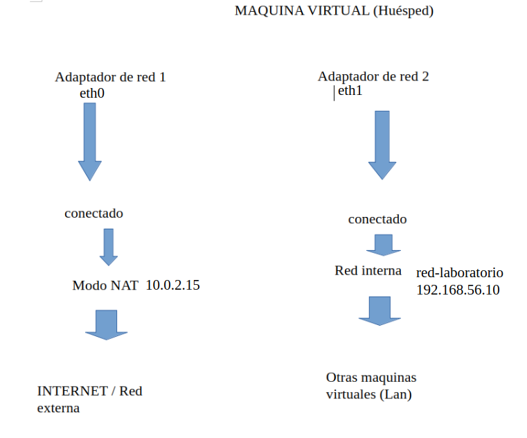
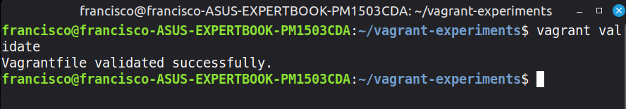
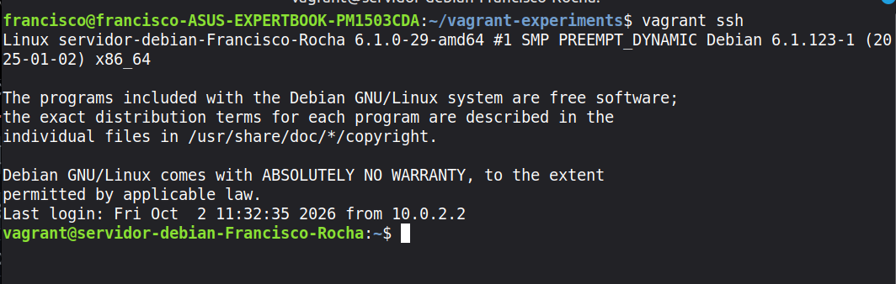
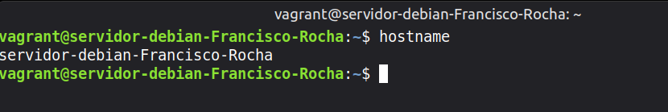
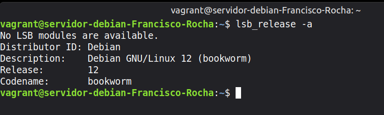
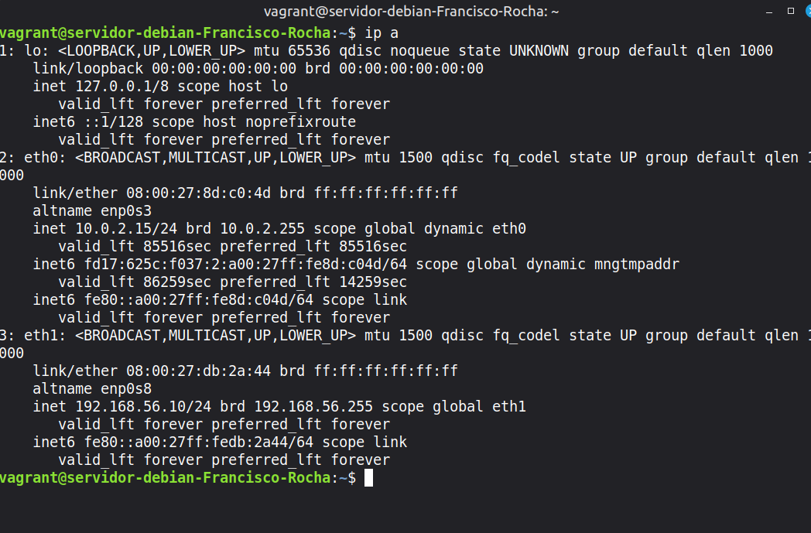
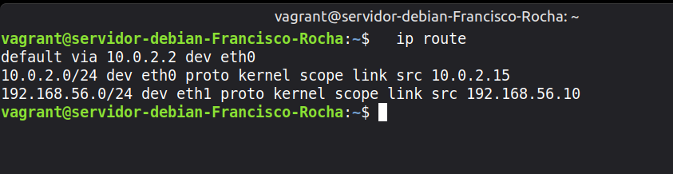

# Tarea-1.1.2-primeros-pasos-con-Vagrant
1. ¿Què es Vagrant? y porque resulta util  
    . Es un software que permite crear maquinas virtuales automaticamente desde un archivo de texto.  
    .  Es util porque solo neceistas un documento de texto para crear la maquina y que la maquina sera igual en todos los equipos  
     1.1 Distingue el anfitrión, el proveedor de virtualización, la box y la máquina virtual  
         . Anfitrión (Host): Tu ordenador físico real (tu portátil, su procesador, su RAM y su sistema operativo).  
         . Proveedor: El programa de virtualización (como VirtualBox) que permite crear y gestionar entornos virtuales.  
         . Box: El molde o plantilla descargable (un archivo con el sistema operativo base) usado para crear la máquina
           rápidamente.  
         . Máquina Virtual (VM): El ordenador virtual final que se crea a partir de la Box y que se ejecuta de forma aislada                  dentro de el ordenador.  
      1.2 lenguaje está escrito Vagrantfile  
         . Está escrito en el lenguaje Ruby   
      1.3 Qué es un provisioner  
         . Un provisioner es la herramienta que automatiza la instalación de software y la configuración dentro de la máquina                 virtual justo después de que arranca.  
      1.4 Dónde se ejecuta el script  
         . Se ejecuta dentro de la máquina virtual  
      1.5 Cuándo lanza el script  Vargrant  
         . Durante el primer arranque, cunado se lo pides explicitamente y cunado lo fuerzas al reiniciar el proceso  
      1.6 Qué diferencia hay entre inline: y path:  
         . inline: El código se escribe dentro del propio Vagrantfile. Sirve para comandos cortos de 1 o 2 líneas.  
         . path: El código está en un archivo externo (como script.sh). Sirve para scripts largos, limpios y ordenados.  
      1.7 Explica qué ocurre si modificas el script después del primer vagrant up y cómo lo ejecutarías de nuevo  
         . No pasará nada de forma automática. Vagrant no detecta los cambios en tiempo real ni vuelve a ejecutar el script por sí                 solo si la máquina ya está creada  
         . Si la máquina está encendida: Ejecuta vagrant provision. Esto corre el script inmediatamente dentro de la máquina                      sin necesidad de apagarla.  
         . Si la máquina está apagada: Ejecuta vagrant up --provision. Esto enciende la máquina y la obliga a ejecutar el script                 modificado durante el arranque.  
       1.8 Que conexión de red configura Vagrant por defecto y para qué la utiliza  
         . Por defecto, Vagrant configura una red tipo NAT  
         . Lo utiliza para ssh y para Acceso a Internet  
       1.9 Cómo se añade en el Vagrantfile una segunda interfaz con dirección IP fija  
         . Para añadir una segunda interfaz de red con una IP fija (estática), debes definir una red privada dentro de tu                         Vagrantfile  
       1.9.1 Compara NAT, red interna, red privada host-only y red pública: explica con quién puede comunicarse la máquina en
               cada caso y qué función cumple el reenvío de puertos  
         . NAT: Solo sale a Internet. Nadie desde fuera (ni tu propio ordenador directamente) puede entrar a ella.  
         . Red Interna: Solo con otras máquinas virtuales vecinas en el mismo ordenador. Sin internet y sin hablar con tu                         ordenador.  
         . Red Privada (Host-Only): Con tu ordenador y con otras máquinas virtuales. No tiene acceso a Internet.  
         . Red Pública (Bridged): Con cualquier dispositivo de tu red local e Internet. Funciona como un ordenador real más                    conectado al router  
        1.9.2 Qué función cumple el reenvío de puertos  
         . Permite acceder a un servicio de la máquina (como un servidor web en el puerto 80) escribiendo localhost:8080
        1.9.3 En una tabla breve, indica cuándo usarías up, status, ssh, reload, provision, halt y destroy; marca cuáles llegaste                 a ejecutar.
   
| Comando | Cuándo usarlo | Ejecutado |
| :--- | :--- | :---: |
| vagrant up | Crear y encender la máquina. | Sí  |
| vagrant status | Ver si está encendida o apagada. | No  |
| vagrant ssh | Entrar a la terminal de la máquina. | Sí  |
| vagrant reload | Reiniciar para aplicar cambios del Vagrantfile. | Sí  |
| vagrant provision | Ejecutar los scripts de instalación de nuevo. | Sí  |
| vagrant halt | Apagar la máquina sin borrar nada. | Sí  |
| vagrant destroy | Borrar la máquina por completo del disco. | No |  

3. Esquema de red de las interfaces  
     

3.Configuración de Vagrantfile  
   
     Vagrant.configure("2") do |config| significa que vamos a usar la sintaxis de la versión 2 de configuración  
     config.vm Ajustes de la Máquina   
     config.vm.box = "base" Define el sistema operativo base  que se descargará para la máquina virtual  
     config.vm.box_check_update = false : Si se activa, apaga las búsquedas automáticas de nuevas versiones del sistema operativo       cada vez que enciendes la máquina  

     config.vm.network configurar redes  
     "forwarded_port", guest: 80, host: 8080  Hace que lo que pase en el puerto 80 (dentro de la máquina) se pueda ver en tu           navegador web normal entrando a localhost:8080  
     host_ip: "127.0.0.1" sirve por seguridad. Bloquea el acceso para que solo tú desde tu ordenador puedas entrar a ese puerto
     "private_network", ip: "192.168.33.10" : Crea una red privada fija.  
     "public_network" Crea una red pública

     config.vm.synced_folder Carpetas Compartidas  
     "../data", "/vagrant_data" Sincroniza carpetas

     config.vm.provider Configuración de VirtualBox  
     config.vm.provider "virtualbox" do |vb| Abre el bloque para modificar parámetros directos del programa VirtualBox  
     vb.gui = true Al encender la máquina, abre la ventana visual de VirtualBox en lugar de ejecutar la máquina oculta en segundo       plano  
     vb.memory = "1024" Asigna los megabytes (MB) de memoria RAM que consumirá la máquina virtual

     config.vm.provision Automatización  
     config.vm.provision "shell", inline: <<-SHELL Activa el aprovisionamiento automático. Le dice a Vagrant que, nada más arrancar la máquina por primera vez, ejecute los comandos de terminal

   4.Mi primera máquina en Vagrant  
   Validar vagrantfile  
   vagrant validate  
       
   Arrancar la maquina  
   vagrant up  
  
   Acceder a la maquina virtual  
   vagrant ssh  
  

   Nombre de la máquina:  
   hostname  
  
   Versión de Debian:  
   lsb_release -a  
  
   Interfaces de red y direcciones IP  
   ip a  
  
   Rutas de red  
   ip route  
     
   5.Como he preparado Apache  
   En config.vm.provision "shell", inline: <<-SHELL
     he rediconado al archivo septup.sh que tiene la configuración para instalar apache y para crear una web personalizada  
  
   6. Bloque de codigp de setup.sh  
```bash
#!/bin/bash

# Actualizar e instalar Apache en líneas separadas para evitar errores
apt-get update
apt-get install -y apache2

# Habilitar e iniciar el servicio correctamente
systemctl enable apache2
systemctl start apache2

# Obtener el nombre del host
HOSTNAME=$(hostname)

# Generar la estructura HTML limpia y completa
cat <<EOF > /var/www/html/index.html
<!DOCTYPE html>
<html lang="es">
<head>
    <meta charset="UTF-8">
    <title>Servidor Debian 12</title>
</head>
<body>
    <h1>¡Servidor Web Funcionando con Éxito!</h1>
    <p><strong>Nombre del alumno:</strong> Francisco Rocha</p>
    <p><strong>Hostname de la máquina:</strong> $HOSTNAME</p>
</body>
</html>
EOF
```
7. Apache en funcinamiento
   
   
   
8. Fuentes consultada
    https://javiermartinalonso.github.io/devops/devops/vagrant/2018/02/09/vagrant-vagrantfile.html
